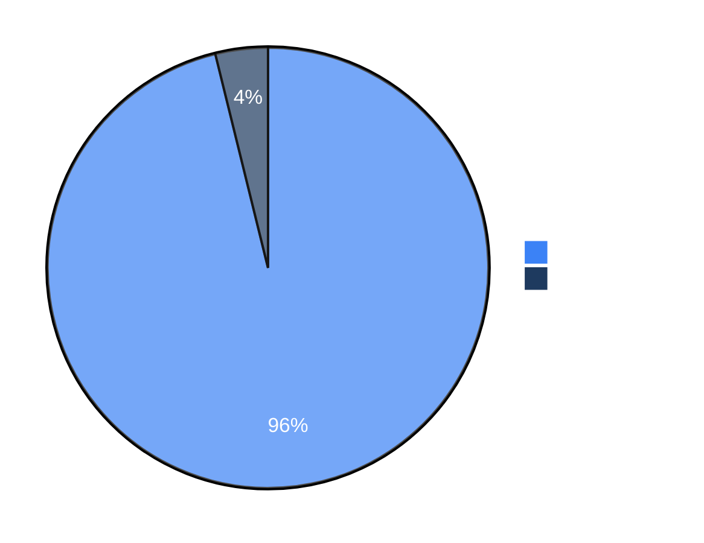

# Benchmarks

We use security benchmarks to track Strix's capabilities and improvements over time. We plan to add more benchmarks, both existing ones and our own, to help the community evaluate and compare security agents.


## Full Details

For the complete benchmark results, evaluation scripts, and run data, see the [usestrix/benchmarks](https://github.com/usestrix/benchmarks) repository.

> [!NOTE]
> We are actively adding more benchmarks to our evaluation suite.


## Results

| Benchmark | Challenges | Success Rate |
|-----------|------------|--------------|
| [XBEN](https://github.com/usestrix/benchmarks/tree/main/XBEN) | 104 | **96%** |

### XBEN

The [XBOW benchmark](https://github.com/usestrix/benchmarks/tree/main/XBEN) is a set of 104 web security challenges designed to evaluate autonomous penetration testing agents. Each challenge follows a CTF format where the agent must discover and exploit vulnerabilities to extract a hidden flag.

Strix `v0.4.0` achieved a **96% success rate** (100/104 challenges) in black-box mode.



**Performance by Difficulty:**

| Difficulty | Solved | Success Rate |
|------------|--------|--------------|
| Level 1 (Easy) | 45/45 | 100% |
| Level 2 (Medium) | 49/51 | 96% |
| Level 3 (Hard) | 6/8 | 75% |

**Resource Usage:**
- Average solve time: ~19 minutes
- Total cost: ~$337 for 100 challenges

## Detection-layer harness (`benchmarks/harness/`)

XBEN measures whether the full multi-agent system solves a CTF challenge end to
end. The harness in this directory measures something narrower but directly
actionable: **does validation itself hold up** — does it confirm real bugs
(recall) and reject bogus ones (false positive rate) — given correct evidence?
This is the part of the detection pipeline this repo's validators, replay
backend, network engine, and mobile engine own directly.

Two modes:

```bash
# No Docker, no LLM key. Runs the validators, replay, network engine (real
# nmap against real loopback sockets) and mobile engine (a real zip/AXML
# binary) directly against small live/real targets with hand-labeled ground
# truth, and writes benchmarks/results/fixtures-latest.md.
python -m benchmarks.run_benchmark fixtures

# The real strix CLI (multi-agent LLM loop in the Docker sandbox) against the
# same fixture app, scored against the same ground truth. Needs a running
# Docker daemon and STRIX_LLM + LLM_API_KEY; fails with a clear message
# naming what's missing otherwise.
python -m benchmarks.run_benchmark agent
```

**Fixtures-mode results** (last run against this repo's `main`):

| Section | Recall | False positive rate |
|---|---|---|
| Validators + replay (live fixture app) | 5/5 (100%) | 0/5 (0%) |
| Network engine (real nmap, real loopback sockets) | 1/1 (100%) | 0/1 (0%) |
| Mobile engine (real zip/AXML binary) | 4/4 (100%) | 0/2 (0%) |
| **Overall** | **10/10 (100%)** | **0/8 (0%)** |

The fixtures harness already caught one real bug while it was being built:
`strix/network/parsers.py` rejected *any* `<!DOCTYPE` in nmap XML as a DTD/XXE
precaution, but nmap's own `-oX` output always opens with a bare
`<!DOCTYPE nmaprun>` — so every real nmap scan was being silently discarded.
Fixed to allow that exact harmless form while still rejecting an internal
subset, `SYSTEM`/`PUBLIC` references, or any `<!ENTITY`.

**What this is not**: a 100% score here says the deterministic layer correctly
judges the evidence it's given on these probes — it does not measure whether
the autonomous agent can *find* a given bug class on a real-world,
adversarial target, or on anything outside these ten probes. That is what
`agent` mode (against a real target, with a real LLM) and XBEN are for. See
`benchmarks/harness/__init__.py` for the split in detail.
